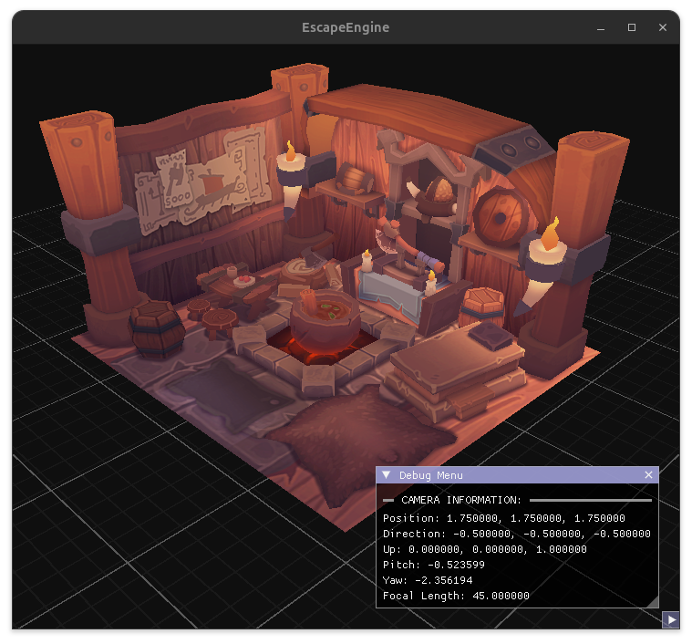

## EscapeEngine
A toy render engine written with a vulkan backend and it's own entity, component, system. 

### Build
WIP

### TODO List
- [ ] Finish BoidsSystem Cycle.
- [ ] Create Boids Compute Shader.
- [ ] Create an GPU abstraction layer. 
- [ ] Basic Refactor of esc system.
- [ ] Add Builds Steps for linux.
